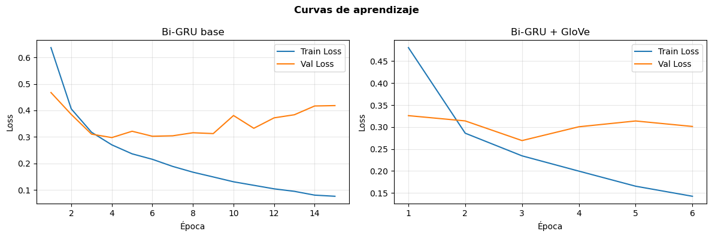
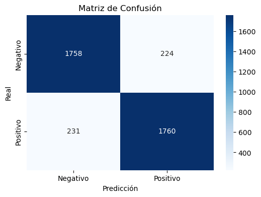
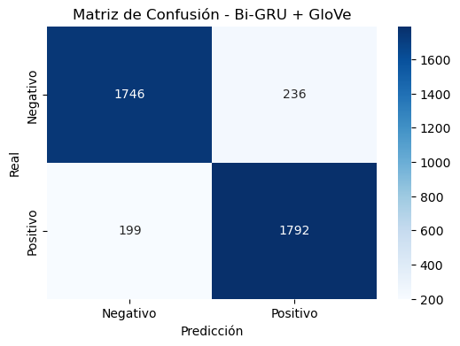

# IMDb Sentiment Analysis with Bidirectional GRU & GloVe Embeddings

End-to-end NLP binary classification pipeline for movie review sentiment analysis using PyTorch. The project benchmarks a baseline Bidirectional GRU against an architecture initialized with pre-trained GloVe embeddings.

## Key Performance Metrics

- **Dataset**: 40,000 raw reviews (balanced binary classification: Positive / Negative).
- **Test Accuracy**: ~89% (Macro F1-Score: 0.89).
- **Architectures**: Custom 2-Layer Bidirectional GRU vs. Pretrained GloVe (100d) Bi-GRU.
- **Key finding**: GloVe initialization converged faster (Epoch 3 vs Epoch 4) with lower validation loss (0.2692 vs 0.2974).

---

## 1. Problem Context

Movie reviews and ratings provide a rich source of unstructured textual data suited for identifying underlying user sentiment. This project implements an end-to-end binary sentiment classification pipeline on IMDb movie reviews, categorizing each text as either **positive** or **negative**.

Recurrent Neural Networks (RNNs) are well-suited for sequence processing and modeling temporal dependencies across textual tokens. Specifically, gated architectures such as `GRU` and `LSTM` capture long-term contextual relationships essential for estimating sequence polarity.

* **Dataset:** [IMDb Movie Ratings Sentiment Analysis (Kaggle)](https://www.kaggle.com/datasets/yasserh/imdb-movie-ratings-sentiment-analysis/data)

---

## 2. Objective

Design, train, and evaluate a recurrent neural network architecture capable of classifying IMDb reviews into binary sentiment categories (**positive** vs. **negative**).

The technical workflow encompasses:
- Text cleaning, regex-based normalization, and noise reduction.
- Vocabulary construction isolated strictly to the training split to prevent data leakage.
- Tokenization, fixed-length sequence padding (`MAX_LEN = 230`), and truncation.
- Architectural implementation and training of a **Bidirectional GRU (Bi-GRU)** model.
- Comparative benchmarking against a **GloVe (100d)** pre-trained embedding variant.
- Quantitative evaluation utilizing Accuracy, Precision, Recall, F1-Score, and Confusion Matrix analysis.

---

## 3. Model Architecture


---

## 4. Repository Structure

```text
├── figures/
│   ├── fig1_curvas.png             # Training & validation loss/accuracy curves
│   ├── fig2a_confusion_base.png    # Baseline Bi-GRU confusion matrix
│   └── fig2b_confusion_glove.png   # GloVe Bi-GRU confusion matrix
├── notebooks/
│   └── sentiment_analysis_gru.ipynb # Complete annotated pipeline
├── .gitignore
├── LICENSE
├── README.md
└── requirements.txt
```

---

## 5. Experimental Results

### Quantitative Benchmark (Test Set: 3,973 samples)

| Metric | Baseline Bi-GRU (Scratch) | Bi-GRU + Pre-trained GloVe |
| :--- | :---: | :---: |
| **Trainable Parameters** | 1,473,545 | 1,473,545 |
| **Optimal Checkpoint** | Epoch 4 | Epoch 3 *(Early Stopped at Ep 6)* |
| **Validation Loss** | 0.2974 | **0.2692** (-9.5%) |
| **Test Accuracy** | **88.75%** (~89%) | **89.25%** (~89%) |
| **Macro F1-Score** | 0.89 | 0.89 |
| **Negative Class (F1)** | 0.89 *(Prec: 0.88, Rec: 0.89)* | 0.89 *(Prec: 0.90, Rec: 0.88)* |
| **Positive Class (F1)** | 0.89 *(Prec: 0.89, Rec: 0.88)* | 0.89 *(Prec: 0.88, Rec: 0.90)* |

### Learning Curves (Loss & Accuracy)
Comparison between baseline Bi-GRU (scratch embeddings) and the pre-trained GloVe-initialized Bi-GRU:



### Confusion Matrices
Holdout test set evaluation (1,982 Negative vs. 1,991 Positive):

| Baseline Bi-GRU | Bi-GRU + GloVe |
| :---: | :---: |
|  |  |

---

## 6. Key Findings & Discussion

1. **Impact of Transfer Learning (GloVe Initialization):**
   - Both models achieve strong test performance near **89% Accuracy / F1-score**, proving that 40k IMDb reviews offer sufficient volume for recurrent nets to learn task-specific embeddings from scratch.
   - However, **GloVe initialization accelerates convergence significantly**: the GloVe model reached its optimal validation checkpoint by **Epoch 3** (vs. Epoch 4 for baseline) and achieved a noticeably lower validation loss (**0.2692 vs. 0.2974**).
   - Early stopping (`patience=3`) successfully prevented unnecessary computation, halting GloVe training at Epoch 6.

2. **Class-level Dynamics:**
   - Both classes exhibit balanced performance across both architectures.
   - The baseline Bi-GRU shows slightly higher recall on negative reviews (89%) and precision on positive reviews (89%).
   - The GloVe model exhibits slightly higher precision on negative reviews (90%) and recall on positive reviews (90%).

3. **Inference on Complex Linguistic Phenomena:**
   - On explicit, canonical reviews (e.g., *"The movie was incredibly good, I loved the plot"*), both architectures output high-confidence predictions (>99%).
   - On ambiguous inputs—such as double negations (*"It wasn't bad, I actually enjoyed parts of it"*) or sarcastic praise (*"What a masterpiece of utter boredom"*)—confidence degrades. This behavior is expected in RNNs with bag-of-tokens vocabulary representations, where semantic compositionality and subtle irony require deeper bidirectional context or attention mechanisms.

---

## 7. Conclusions

- **End-to-End Rigor:** A fully reproducible NLP pipeline was established, strictly isolating vocabulary construction to the training split to eliminate data leakage and stratifying the 80/10/10 partition.
- **Bi-GRU Efficiency:** Bidirectional GRUs strike an optimal balance between parameter footprint and sequential representational capacity, reaching state-of-the-art non-transformer performance (~89% accuracy) with ~1.47M parameters.
- **Transfer Learning Value:** Incorporating pre-trained semantic spaces (GloVe 100d) consistently yields lower empirical loss and faster convergence, making it a recommended default for low-resource or fast-iteration deep learning workflows.
- **Future Work:**
  - Benchmark against an equivalent Bidirectional LSTM and multi-head Self-Attention heads.
  - Implement dynamic learning rate scheduling (e.g., Cosine Annealing or ReduceLROnPlateau).
  - Fine-tune transformer architectures (e.g., DistilBERT or RoBERTa) to better resolve sarcasm and contextual negation.

---

## 8. Getting Started

### Installation
Clone the repository and install dependencies:
```bash
git clone https://github.com/JeffersonMoreno-137/sentiment-analysis-bigru.git
cd sentiment-analysis-bigru
pip install -r requirements.txt
```

### Running the Notebook
Launch Jupyter Lab:
```bash
jupyter lab notebooks/sentiment_analysis_gru.ipynb
```
